# LoreReviser

A SillyTavern extension that reads and updates lorebooks to reflect story and character changes.
See [PLAN.md](PLAN.md) for the design and milestones, and [docs/milestone1-findings.md](docs/milestone1-findings.md) for the SillyTavern API research.

**Status: milestone 5 (new entries).** Send asks the model to revise the selected entries and shows the proposals for review. **Approve saves the change into your lorebook**, and the old version is kept in a History file, so every change can be looked at and undone later. **New entries** mode asks the model for new entries in a lorebook you pick; they go through the same review cards, and Approve creates them. By default revisions use **Changed passages only**: the model sends back just the passages it changes and LoreReviser fills them into the full text, which keeps replies small. The **pencil** next to each entry in the sidebar opens it to read or edit by hand, without a model. Tested with a scripted fake model; not yet with a real model.

Requires SillyTavern **1.19.0 or newer** (the Connection Manager extension must be enabled, which it is by default).

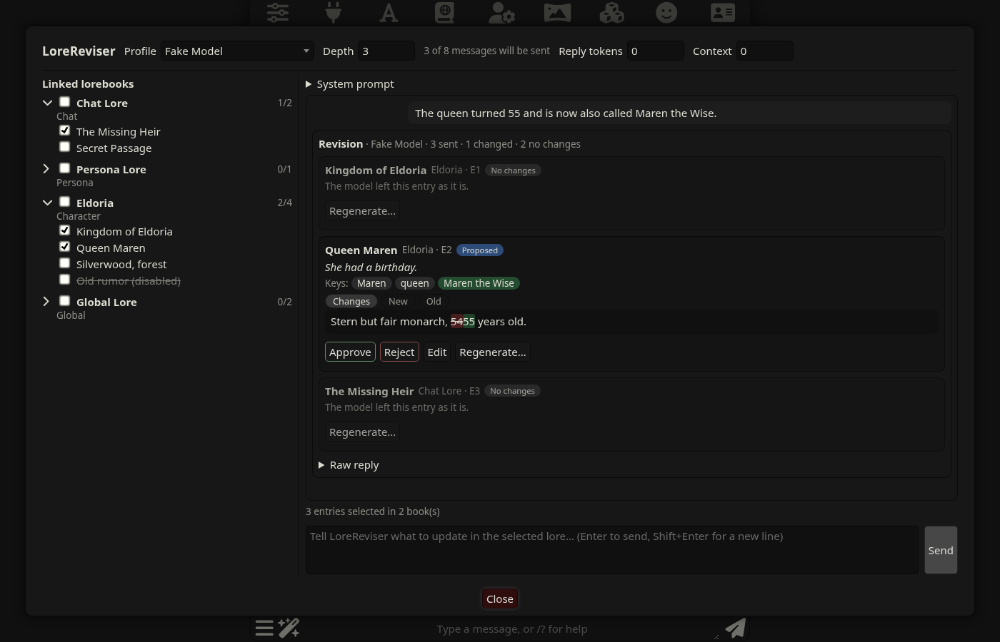

## What it does now
- Adds **LoreReviser** to the wand (extensions) menu next to the chat input. It opens a large modal.
- **Sidebar:** only the lorebooks linked to the open chat: global, character (primary and extra), chat, and persona. Each book expands to show its entries (title, or first keys if untitled; disabled entries are dimmed). Tick a whole book (tri-state box) or single entries. The selection is saved per chat. The **pencil** at the end of each entry opens it in the entry editor (see "Reading and editing an entry directly"); clicking it never ticks or unticks the box.
- **Profile:** a Connection Manager profile used only by LoreReviser (independent of your main connection).
- **Prompts** (button with the sliders icon at the end of the header): opens a separate large window with every prompt text you can edit, so they no longer take space above the chat. It has five collapsible sections: **System prompt**, **Rewrite intensity wording**, **Change type wording**, **Reply format rules (advanced)** and **New entry prompt**. Edits are saved as you type and are used from the next Send, Propose or Regenerate on; close the window with **Close** (or Esc). The button shows "(edited)" while any prompt text differs from its default.
- **System prompt** (in the Prompts window): editable, with a **Restore default** button. Saved in extension settings.
- **Change:** *Development* (default) = the change is a progression in the story, so the lore may describe before/after, history and what changed. *Retcon* = the existing reality is changed and must be written as though it was always true: no "new", "now", "recently", "no longer", "changed", "became" and no acknowledgement of the change. Saved between sessions, used on Send and on Regenerate, and shown on every attempt next to the Rewrite intensity. The wording of each is editable under **Change type wording** in the Prompts window (Restore default per type).
- **Rewrite intensity wording** and **Reply format rules (advanced):** collapsible sections in the Prompts window, under the system prompt (together with **Change type wording**). They hold the other parts of the system message that LoreReviser appends: the text for each of the three Rewrite levels (edited separately) and the strict reply-format rules. The reply-format rules come in two sets, one per **Reply style** (*Changed passages only* and *Full rewrite*); only the set for the chosen style is sent, and rules you customized before this version are your *Full rewrite* rules and keep working for Full rewrite. Each text has its own **Restore default** button, and the rewrite-intensity heading stays fixed so the system prompt's reference to it remains valid. If you edit a set of reply-format rules so that it no longer asks for what LoreReviser can read (a JSON array of `{id, edits: [{find, replace}], ...}` for Changed passages, `{id, keys?, secondary_keys?, content?, note?}` for Full rewrite), a warning is shown in the section and in the chat when you send (sending still works). See `docs/prompt-format.md`.

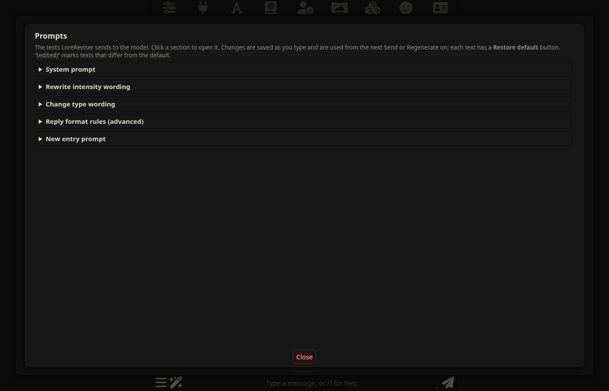
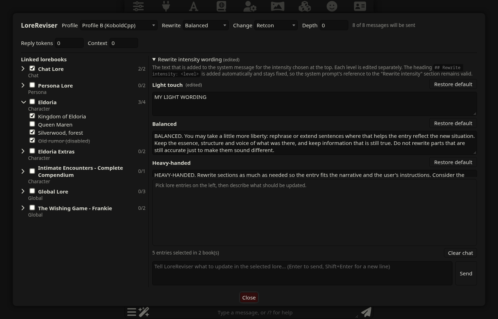
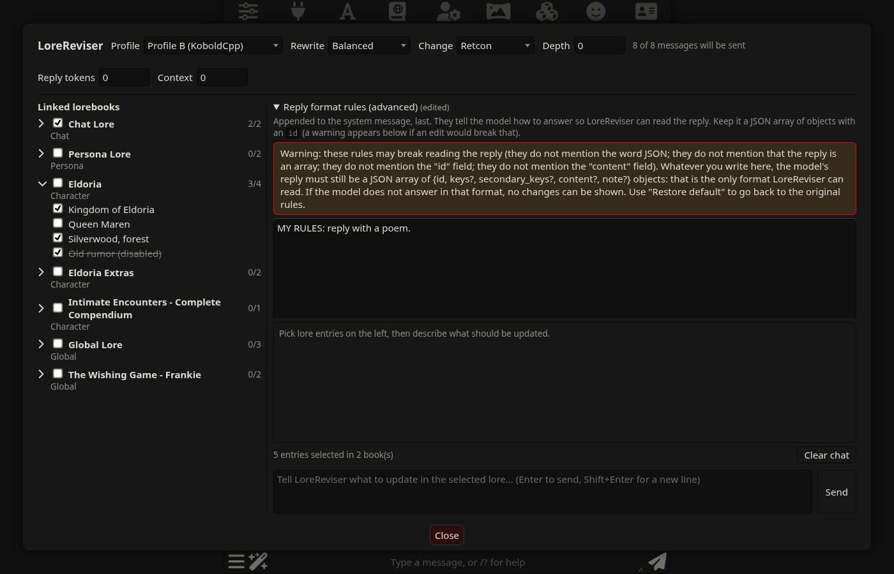
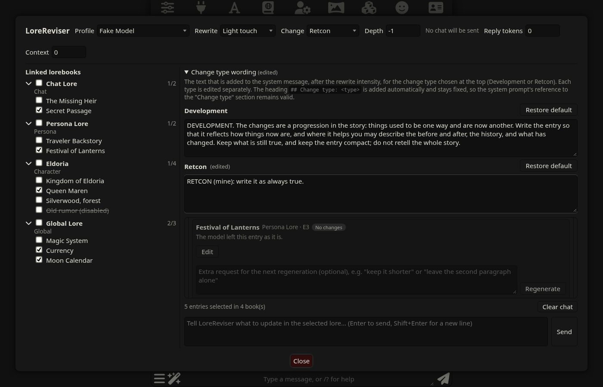
- **Rewrite:** how much the model may change. *Light touch* = only what must change for the new narrative (pronouns, a physical detail, ...), everything else verbatim. *Balanced* (default) = a little liberty, same essence. *Heavy-handed* = rewrite sections as needed to fit the narrative. Saved between sessions and also used by Regenerate. The prompt also tells the model to keep each entry's existing formatting (markdown, line breaks, bracket styles, field layouts, lists, casing, macros, decorators, regex keys). Every level (and every other default prompt part, including the new-entry prompt) also forbids changing existing headings and field labels: `HEIGHT:` stays `HEIGHT:` (never `HIGHT:`, never renamed or re-cased) unless you explicitly ask for a rename. Texts you customized keep your version; **Restore default** brings in the current wording.
- **Reply style:** how the model answers when revising existing entries. *Changed passages only (saves tokens)* (default) = the model sends back only the passages it changes, each as the exact old passage plus its new text (`find` / `replace`), and LoreReviser puts them into the entry's full text itself, so replies are much shorter. *Full rewrite* = the model sends the whole new text of every changed entry (the earlier behaviour). Saved between sessions; Regenerate uses the style chosen at that moment. New entries are always written in full, so the setting is hidden in New entries mode. See "Changed passages only" below.
- **Depth:** send only the last X chat messages. `0` = whole chat, `-1` = **no chat at all** (the label then reads "No chat will be sent"; the character card, active lore, selected entries and your instructions are still sent, and the prompt says that no chat history is provided). Hidden messages are never counted or sent. The "active lore" part is still worked out from the chat the way SillyTavern normally does, so lore that the chat would trigger can appear, but no chat text is sent.
- **Chat window:** type instructions and press Enter (Shift+Enter for a new line). Sending needs a profile, at least one selected entry, and non-empty instructions; otherwise a red error is shown and nothing is sent.
- **Reply tokens / Context:** the reply budget (0 = automatic) and the context size used for the "prompt may be too large" warning and for SillyTavern's World Info budget when working out the active lore (0 = taken from the profile's preset, else the current settings of the profile's API). The warning never blocks sending.

## How a revision works
1. Pick entries in the sidebar, write what should change, press Send. One request goes to the chosen profile with your system prompt, the character card, the lore that is active right now (without the entries you selected: an entry that is both selected and active is sent only once, in full, with the entries to revise; the chat shows a note such as "2 selected entries were already active; sent once"), the last X chat messages (Depth; none at -1), the full text and keys of every selected entry, and your instructions. Exact format: [docs/prompt-format.md](docs/prompt-format.md).
2. The model answers with the entries it changed. Each shows up as a card with the key changes and a block-level comparison. **Changes** (the default) lists unchanged sentences dimmed, then removed and added blocks, with each sentence on its own line so multi-paragraph lore stays readable (not flattened into one blob); **Full Compare** shows old and new side by side (stacked on narrow screens) with unchanged paragraphs dimmed and each changed region as a removed block next to the added block; **New** / **Old** show the plain text with newlines preserved. There is no word-by-word marking. Entries the model did not change are shown as "No changes". After a regenerate, swipe arrows with an n/N counter page between attempts, and the modal remembers which attempt you were on when you close and reopen it.
3. Per card: **Approve** (saves it to the lorebook, see "Saving and History" below), **Reject**, **Edit proposal** (the main edit button: the keys plus one box per changed part of the text, filled with the proposed green text, with the removed old text shown above it and a **Use old text** button; the unchanged text is shown dimmed and stays exactly as it is, so you don't have to find your way through the whole entry; empty a box to drop that change), **Edit full entry** (the keys and the whole text in one box; also reachable from inside Edit proposal, keeping what you typed). Editing is available on every card, also after Approve/Reject; "No changes" entries and new-entry cards have a single **Edit** with the whole text. The card shows "Edited by you", an edit after approval needs approving again, what you save is exactly what Approve will write, and **Reset to the model's version** undoes your edits, **Regenerate** (a multi-line box is always shown under the card: type an extra request for that regeneration if you like; the model sees its earlier attempts and their requests, each attempt remembers its request and rewrite intensity, and you can page between attempts with ‹ ›).
   Cards can be folded: click a card's header line (or the small arrow at its left) to hide or show its details; a folded card shows just the entry name, its book and its status. Approved cards fold up by themselves, so the ones still waiting for a decision stand out; Undo, or a click on the header, opens it again. Folding is remembered while the page is open, also when you close and reopen LoreReviser.

   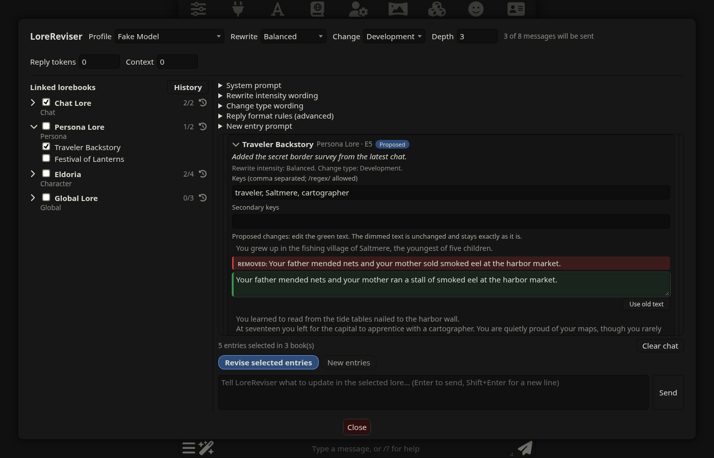
   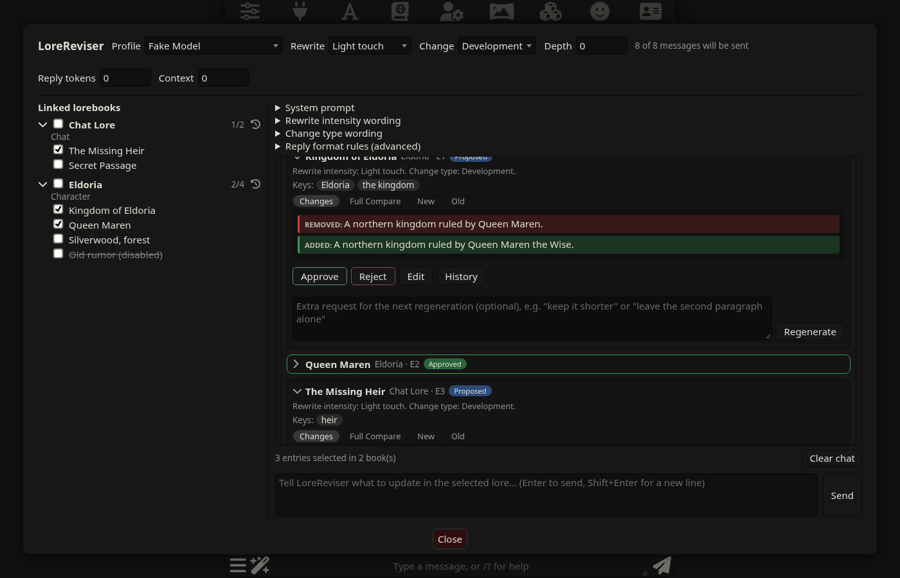
4. **Changed passages only** (the default Reply style): the model returns, per changed entry, a list of edits such as `{"find": "54 years old", "replace": "55 years old"}` (or `{"after": "an existing passage", "insert": "new text"}` to add something), plus the keys if they change. LoreReviser looks each passage up in the entry's current text: first exactly, then ignoring differences in spacing and line breaks, curly vs straight quotes, dash types and `…` vs `...`. Each passage must occur exactly once, and edits may not overlap. The result is the entry's complete new text, so every view (Changes, Full Compare, New, Old), Edit proposal, Approve and History work exactly as with a full rewrite; the attempt line says e.g. "Reply: 2 changed passages, put into the full text".
   If any edit for an entry can't be placed (the passage isn't in the entry, appears more than once, or overlaps another edit), **nothing** is applied to that entry: it shows **Couldn't apply** with a red box listing each passage that didn't fit and why, plus **Retry this entry as a full rewrite** (one request for just that entry that asks for its complete text, with the Full rewrite rules; your Reply style setting stays as it is), the usual Regenerate box, and Edit to write the change yourself. If a *regeneration* doesn't fit, no attempt is added and the earlier attempts stay as they were, with the same red box. A model that sends the whole text anyway is still understood. Not tested with a real model yet: if a model keeps misquoting passages, switch Reply style to Full rewrite.

   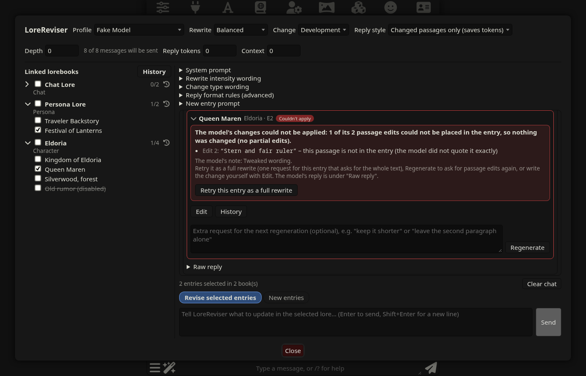
5. Yellow warnings appear when a proposal drops a `@@decorator` line, a `/regex/` key or a `{{macro}}` the original had.
6. Entries the model leaves out of a complete reply show "No changes". "Not returned" appears only with real evidence: the reply ended inside the JSON (the warning shows the finish reason and tokens received / allowed), or that entry's part was unreadable. **Retry missing entries** asks again for just those. The automatic reply budget is generous (at least 4096 tokens, up to 32000) because thinking models spend part of it before answering; with Changed passages only it is smaller for large entries (about 1.25x the entries' size + 2500 instead of 2x + 2500; Heavy-handed keeps the larger budget because it can change most of the text), and a "Reply tokens" value you set always wins; common JSON slips (raw line breaks, unescaped quotes) are repaired automatically. If the reply can't be read at all, you see an error plus the raw reply. Every revision also has a "Raw reply" section.
7. **Clear chat** (under the chat window) removes all messages and review cards but keeps your settings and selection; it asks first if proposals are still undecided. **Cancel** stops a running request. Models that "think" before answering use part of the reply tokens for that; raise Reply tokens if replies get cut off.

## New entries
Creating entries is separate from revising. Below the chat window, switch from **Revise selected entries** to **New entries**:

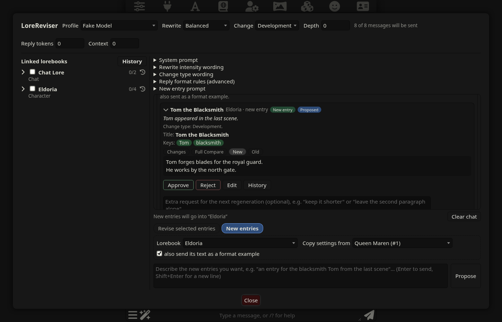

1. **Lorebook:** where the new entries go. The lorebooks linked to the chat are listed first, then every other lorebook. The last choice is remembered.
2. **Copy settings from** (optional): an entry of that lorebook whose settings the new entries get: everything except its content, title and keys (order, position, depth, role, probability, inclusion group, filters, timed effects, recursion and match options, constant/selective, even "disabled"). With "(none)" the new entries get SillyTavern's defaults, exactly as the World Info editor's "New entry" button makes them. The settings are copied when you press Approve, so they are the entry's current ones.
3. **also send its text as a format example** (on by default, only with an entry chosen): the chosen entry's keys and text are sent to the model so the new entries follow its layout and style. The model is told not to copy its facts.
4. Type what you want ("an entry for the blacksmith Tom from the last scene", "entries for the three guild leaders") and press **Propose** (or Enter). One request goes to the profile, with the character card, the active lore, the chat (Depth), the titles and keys of the entries already in the target lorebook (so the model avoids duplicates; no content), the format example and your instructions. The model can propose one or more entries; each comes back with a title, keys (and secondary keys) and content. Exact format: [docs/prompt-format.md](docs/prompt-format.md#new-entries).
5. Each proposal is a **review card** like a revision card, with a green "New entry" label: the Old side is empty, so **New** is the default view (Changes / Full Compare / Old also work). Yellow warnings appear when a proposal has no keys or no content, or when its title or a key is already used by an entry in that lorebook (a possible duplicate). **Edit** includes the **Title**. **Regenerate** works as for revisions (swipe arrows, extra request per attempt; the model sees its earlier attempts).
6. **Approve** creates the entry in the lorebook (title, keys, secondary keys, text, plus the copied or default settings) at the end of the editor's list, refreshes the World Info editor if that book is open, and records it in History. The card folds up and shows "Created in the lorebook ... as entry #N". The sidebar shows the new entry right away; from then on it is an ordinary entry that can be revised.
7. **Undo** on an approved new-entry card removes the entry again, but only if it is still exactly as created (keys, text and title); if it was changed meanwhile, Undo refuses (delete it in the World Info editor if you don't want it). **Reject** on a card you edited after approving it also removes the entry. Editing an approved card and approving again updates the created entry (text, keys and title) instead of making a second one.
8. Safety: if the lorebook was deleted or renamed, or the entry to copy settings from no longer exists, nothing is created and the card stays "Proposed" with the reason. If the model proposes nothing (`[]`), the chat says so.

Change type (Development / Retcon) applies to new entries too (Retcon: written as though it was always true). **Rewrite intensity is not used** for new entries, because there is no existing text to rewrite. The system prompt and reply-format rules for new entries are separate from the revision ones and editable under **New entry prompt** in the Prompts window (each with Restore default; a warning appears if edited rules no longer ask for a JSON array with content and keys). Reply tokens: 0 = 8192 for new entries. Deleting entries is not part of LoreReviser (only removing an entry it created, see above).

## Reading and editing an entry directly
Click the **pencil** next to an entry in the sidebar to open it in a large editor on top of the modal. **No model is used**: nothing is sent anywhere.
- It shows the entry's title, its number and lorebook, the **Keys** and **Secondary keys** (comma separated, `/regex/` allowed) and the whole **Content** in a big text box, loaded fresh from the lorebook. Disabled entries open too (the editor says they are disabled).
- Everything is editable straight away. The title and the entry's settings (order, position, ...) are not changed here; use the World Info editor for those. "Unsaved changes" appears once you type, and the bottom right shows the character and word count.
- **Save** writes the text, and the keys if you changed their boxes, into the lorebook and closes the editor. A key box you didn't touch is kept exactly as it was, so opening and saving never rewrites the keys. Save with nothing changed just closes.
- **Cancel** (or Esc) writes nothing. If you typed something, it asks first: **Discard** or **Keep editing**.
- **Safety check:** the same one as Approve. If the entry was changed in the lorebook after you opened it (in the World Info editor, by an approval, a restore, ...), Save refuses with a yellow note and nothing is overwritten. **Reload from lorebook** loads the current text; what you typed stays in a box below the editor so you can copy it back in.
- **History:** every save is recorded as a **Manual edit** (purple label, with what changed: text, keys, secondary keys) and can be restored like any other change. **History for this entry** in the editor opens that entry's History; if you restore from there while nothing is typed, the editor shows the restored text.
- A review card whose entry you then edit by hand can no longer be approved (its safety check sees the change); send a new revision to work from the new text.

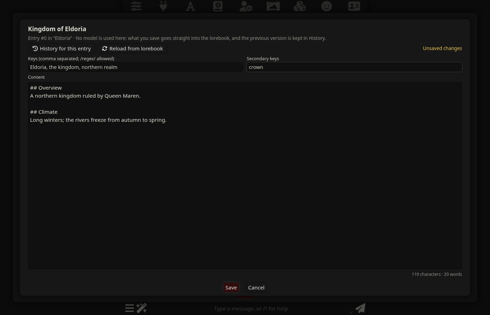

## Saving and History
- **Approve** writes the approved keys, secondary keys and text into the lorebook entry straight away (nothing else about the entry is touched: title, order, position and other settings stay as they are). The World Info editor is refreshed if that book is open in it. The card says "Saved to the lorebook".
- **Safety check:** before saving, LoreReviser reads the entry again. If it was changed since the revision was made (for example by you in the World Info editor, or by another approval), it does **not** overwrite it: the card goes back to "Proposed" with a red note. Send a new revision for that entry to work from its current text.

  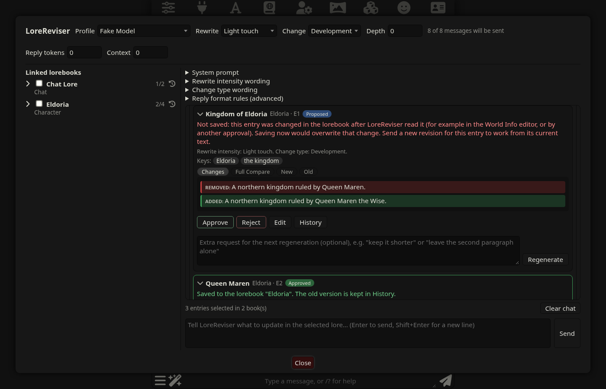
- **Undo** on an approved card puts the old version back into the lorebook (and notes that in History). If the entry was changed again after you approved it, Undo refuses and tells you to use History instead. **Reject** on a card you edited after approving it also puts the original back.
- **History:** every saved change is recorded: the entry, its old and new keys and text, the time, your instructions, and the rewrite intensity and change type. Open it anytime (even with an empty chat / no review cards) via the **clock icon** next to a lorebook in the sidebar, the **History** button in the sidebar title (picks a lorebook that has saved changes), or the **History** button on a card (just that entry). Changes are listed newest first, with a **Show** filter (one entry or all) and a **Kind** filter (e.g. only Approved changes, only Manual edits, only Restores; with counts); each row is **collapsible** like a review card (click the header to fold/unfold; newest starts expanded, older ones start collapsed), with the same Changes / Full Compare / New / Old views as the cards when expanded.
- **Restore old version** (in History) puts the "Old" side of a change back into the lorebook after asking you. The text it replaces is recorded in History first, so a restore can be restored again and nothing is lost. If the entry was changed outside LoreReviser since its last recorded change, the question says so. If the entry changes while the question is open, nothing is written.
- Entries that were deleted, or lorebooks that no longer exist, can't be written to; you get a plain message instead.
- **New entries in History:** a created entry shows as "New entry created" (Old side empty, with where its settings came from). Its button is **Remove this entry** instead of Restore: it takes the entry out of the lorebook again after asking, but only while it is still exactly as created; if it was changed since (by a later revision or in the World Info editor), it refuses. A removal (from Undo or from History) is listed as "Entry removed (creation undone)" and keeps a full copy of the entry with all its settings; its button **Create it again** puts it back (under its old number if that is free, otherwise a new one; it refuses if the same entry is already there). Removing, Undo of a creation and Create it again are recorded in History as well, so nothing is lost.
- A new entry never reuses the number (uid) of an entry that already has History in that lorebook (SillyTavern itself reuses the lowest free number), so two entries' histories never mix.

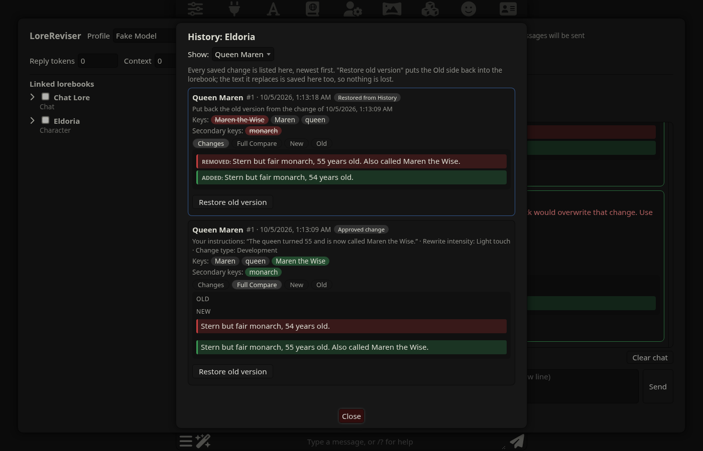
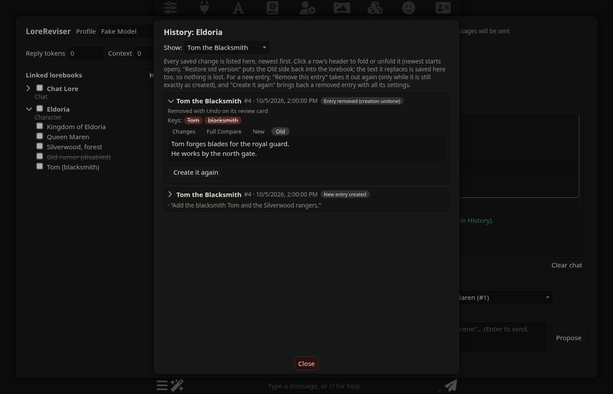

### Clearing old History
History files grow with every saved change. To trim them, open a lorebook's History and use **Clear old history** at the top: pick **older than 7 days**, **30 days**, **90 days** or **1 year**, or **all history for this lorebook**, then press **Clear…**. It always asks first and says how many saved changes will be removed (it applies to every entry of that lorebook, whatever the "Show" filter is). Newer changes are kept. If nothing is that old, it just tells you so.
- Each History row also has a **trash icon** (right end of its header) to remove just that one saved change, again after asking.
- **Only History is removed. The lorebook itself is never changed**: your entries keep their current text, keys and settings. But once removed, those old versions can't be restored, and a removed entry whose saved copy is cleared can no longer be brought back with "Create it again" (the question warns you when that applies).
- "All history" empties the lorebook's History file rather than deleting it, so the file and its link to the lorebook stay, and new changes are recorded as usual. A note of each clean-up (when, how many) is kept in the file.
- Entry numbers only stay reserved for entries that still have History, so after clearing, SillyTavern may give a new entry a number that an old, cleared entry used.

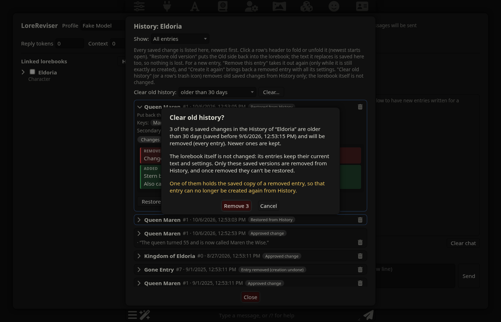

### Where History is stored
One file per lorebook in SillyTavern's `data/<user>/user/files/` folder, named `LoreReviser-archive__<name>__<code>.json` (the name is the lorebook name reduced to plain letters, digits and dashes; the code is a short fingerprint of the full name, so different books never share a file). SillyTavern only allows flat file names with plain letters there, which is why there is no folder. The real lorebook name is stored inside the file. They are ordinary JSON files and are included in SillyTavern's backups of your user data. LoreReviser remembers which file belongs to which lorebook in its settings.

### Renamed lorebooks: "Orphaned history files"
SillyTavern doesn't tell extensions when a lorebook is renamed. If a lorebook with saved History no longer exists under that name, the sidebar shows it under **Orphaned history files**. Pick the lorebook it belongs to now and press **Relink**; its History then shows up under the new name (the file itself keeps its name). **View** lets you look at it first. Nothing is ever deleted automatically: if you deleted the lorebook on purpose, you can ignore the entry, or press **Delete** to remove that history file for good (it asks first and says how many saved changes it holds; no lorebook is changed). Delete refuses if a lorebook with that name exists again (use Clear old history in its History instead), and never deletes a file that isn't a LoreReviser history file.

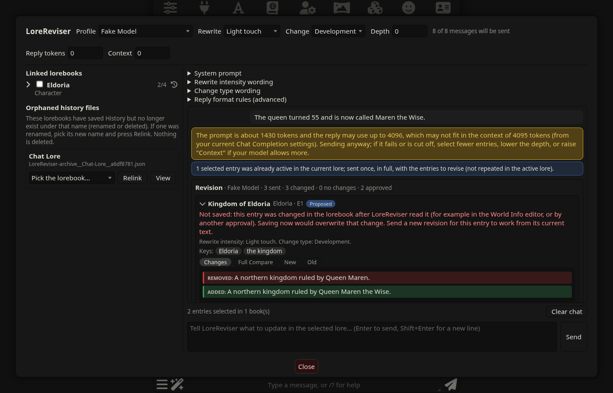
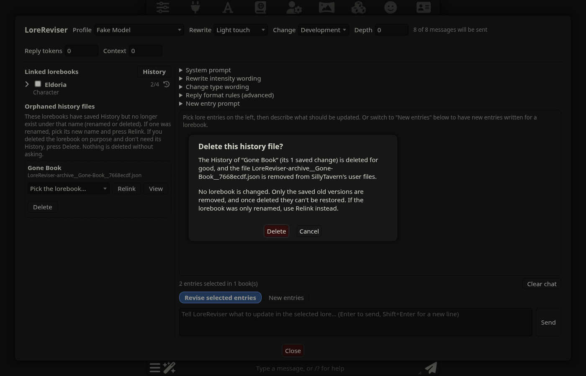

Things to know: the lore being revised is usually also part of the "active lore" in the prompt (the model is told). Selected entries are read straight from the lorebook files and always sent in full: SillyTavern's World Info budget, recursion and activation limits only affect the "active lore" block (it can be shortened, and a note tells you when SillyTavern's budget really left entries out, with the numbers: tokens used/allowed, the percentage, which context size it came from and the cap if set; SillyTavern's own "budget reached" toast is suppressed for LoreReviser's lookup).

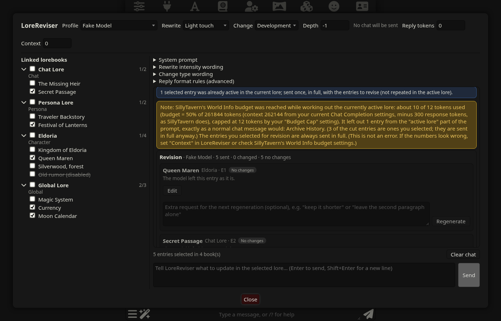 Group chats are untested. Text-completion profiles are untested (chat-completion profiles are what the tests use).

## Install on Windows (PowerShell)

SillyTavern here is at `C:\sillyTavern\SillyTavern-Launcher\SillyTavern`. Extensions live in `data\default-user\extensions`.

### Option 1: git clone (simplest)
```powershell
cd C:\sillyTavern\SillyTavern-Launcher\SillyTavern\data\default-user\extensions
git clone https://github.com/Spanky-Harrison/LoreReviser.git
```
Update later:
```powershell
cd C:\sillyTavern\SillyTavern-Launcher\SillyTavern\data\default-user\extensions\LoreReviser
git pull
```

### Option 2: keep your working copy elsewhere and use a junction
Useful if you develop in another folder. Clone it wherever you like, then link it in:
```powershell
git clone https://github.com/Spanky-Harrison/LoreReviser.git C:\dev\LoreReviser
New-Item -ItemType Junction `
  -Path "C:\sillyTavern\SillyTavern-Launcher\SillyTavern\data\default-user\extensions\LoreReviser" `
  -Target "C:\dev\LoreReviser"
```
Remove the link without deleting your files: `(Get-Item <link path>).Delete()` (or `cmd /c rmdir <link path>`).

### Option 3: from inside SillyTavern
Extensions panel -> **Install extension** -> paste `https://github.com/Spanky-Harrison/LoreReviser`.

After installing, **hard-refresh the SillyTavern tab (Ctrl+F5)**. Open a chat, click the wand next to the message box, then **LoreReviser**.
If it does not appear, check the Extensions panel for load errors and the browser console (F12) for red errors.

## Known quirks
- **Data Maid lists the History files.** SillyTavern's **Data Maid** tool lists every file in `user/files` that no chat refers to as a "loose file", so the `LoreReviser-archive__....json` files show up there. Deleting them there deletes that lorebook's History (your lorebooks themselves are not affected). Leave them unticked unless you really want the History gone.
- Two browser tabs approving changes to the same lorebook at the same moment could each miss the other's History record. Use one tab at a time.
- Group chats: the sidebar tries to include each group member's character lorebooks, but this has not been tested yet.

## Files
| File | Purpose |
|---|---|
| `manifest.json` | Extension manifest |
| `index.js` | Entry point: adds the wand menu item |
| `modal.js` | The modal UI (settings, sidebar, chat window, Send flow) |
| `prompts-window.js` | The Prompts window (header button): all editable prompt texts, Restore default, rule warnings |
| `prompt.js` | Builds the revision prompt, token estimate and context limit |
| `revision.js` | Sends the request on the profile, turns replies into review items, regenerate |
| `create.js` | New entries: builds and sends the request for a target lorebook, turns replies into review items, regenerate |
| `create-core.js` | New-entry default prompt and rules, request builder, proposal reading, settings copy, uid choice (no SillyTavern code; unit-tested) |
| `parse.js` | Tolerant reader for the model's JSON reply, integrity warnings |
| `passages.js` | "Changed passages only": reads the model's find/replace edits and puts them into the full text (exact, then tolerant match; unique; no overlaps; all or nothing). No SillyTavern code; unit-tested |
| `rules.js` | The reply styles and the default reply-format rules for each (Changed passages only / Full rewrite), with the parse-safety checks |
| `budget.js` | World Info budget arithmetic and note; the automatic reply-token budget |
| `diff.js` | Block diff and key-list diff for the cards; the changed-parts split used by "Edit proposal" (exact sentence slices, so edits go back in place) |
| `views.js` | Shared display pieces: key chips and the Changes / Full Compare / New / Old views |
| `review.js` | The review cards (approve / reject / edit / regenerate / paging / fold) |
| `apply.js` | Writing to lorebooks: Approve, Undo, Restore, Save in the entry editor, with the safety check; creating new entries, removing them again, creating them again from History |
| `archive.js` | Reading and writing the History files, the index, relinking, clearing records, deleting orphaned files |
| `archive-core.js` | File names, records and index logic (no SillyTavern code; unit-tested) |
| `history.js` | The History window with Restore, the entry and kind filters |
| `entry-editor.js` | The direct entry editor opened by the sidebar pencil (read / edit keys and text by hand, Save through the safe write path) |
| `manual-core.js` | Entry-editor logic: key boxes, what changed, unsaved-changes check (no SillyTavern code; unit-tested) |
| `lorebooks.js` | Finds the lorebooks linked to the current chat and lists their entries |
| `settings.js` | Extension settings and defaults |
| `style.css` | Styling |
| `tests/` | Headless-browser test scripts (see `tests/README.md`) |

## Tests
`tests/` has unit tests for the parser, the passage-edit applier, diff (including the "Edit proposal" hunks), prompt defaults and History file logic, and Playwright scripts that start a throwaway SillyTavern, seed test lorebooks, and drive the modal in headless Chrome, including a fake OpenAI-compatible model server with scripted replies (normal, truncated, malformed, error, slow). `e2e-archive.mjs` checks saving, History, Restore, the safety checks, folding cards, relinking, Clear old history (older than / one record / all) and deleting orphaned files, verifying every lorebook change through SillyTavern's own API. `e2e-create.mjs` checks the new-entry flow: the request, the cards, Approve creating entries with copied or default settings, Edit, Regenerate, Undo/Reject removing them, History remove / create again, and the safety checks. `e2e-passage.mjs` checks the Changed passages only reply style: the request, the cards and their diff, Approve saving the full built text, the tolerant match, edits that can't be placed ("Couldn't apply", the passage list, Retry this entry as a full rewrite, Edit, a failing regeneration), the setting and the two rule sets; `e2e-revision.mjs` runs with Full rewrite. `e2e-direct-edit.mjs` checks the entry editor: the pencil opens the entry without a model request and without touching the checkboxes, Save writes text and keys (verified through SillyTavern's API), Cancel/Discard write nothing, the safety check refuses and Reload recovers, History shows Manual edit records with the Kind filter and Restore works, and revising still works afterwards. See `tests/README.md`; `tests/run-all.sh` runs everything.
