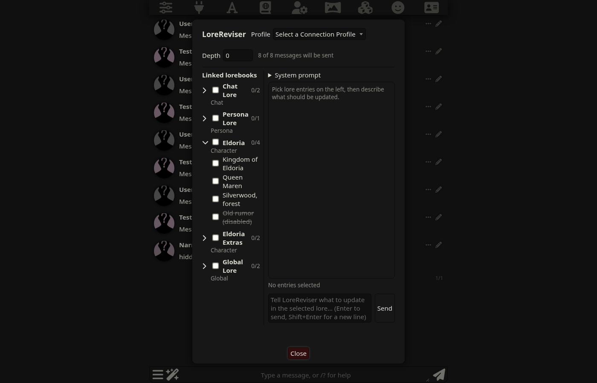

# LoreReviser

A SillyTavern extension that reads and updates lorebooks to reflect story and character changes.
See [PLAN.md](PLAN.md) for the design and milestones, and [docs/milestone1-findings.md](docs/milestone1-findings.md) for the SillyTavern API research.

**Status: milestone 2 (UI skeleton).** The modal, lorebook sidebar, profile selector, system prompt and depth setting work. **No model calls are made yet**: Send only echoes your instruction.

Requires SillyTavern **1.19.0 or newer** (the Connection Manager extension must be enabled, which it is by default).



## What it does now
- Adds **LoreReviser** to the wand (extensions) menu next to the chat input. It opens a large modal.
- **Sidebar:** only the lorebooks linked to the open chat: global, character (primary and extra), chat, and persona. Each book expands to show its entries (title, or first keys if untitled; disabled entries are dimmed). Tick a whole book (tri-state box) or single entries. The selection is saved per chat.
- **Profile:** a Connection Manager profile used only by LoreReviser (independent of your main connection).
- **System prompt:** editable, with a reset button. Saved in extension settings.
- **Depth:** send only the last X chat messages (0 = whole chat; hidden messages are not counted).
- **Chat window:** type instructions and press Enter (Shift+Enter for a new line).

## Install on Windows (PowerShell)

SillyTavern here is at `C:\sillyTavern\SillyTavern-Launcher\SillyTavern`. Extensions live in `data\default-user\extensions`.

### Option 1: git clone (simplest)
```powershell
cd C:\sillyTavern\SillyTavern-Launcher\SillyTavern\data\default-user\extensions
git clone https://github.com/Spanky-Harrison/LoreReviser.git
```
Update later:
```powershell
cd C:\sillyTavern\SillyTavern-Launcher\SillyTavern\data\default-user\extensions\LoreReviser
git pull
```

### Option 2: keep your working copy elsewhere and use a junction
Useful if you develop in another folder. Clone it wherever you like, then link it in:
```powershell
git clone https://github.com/Spanky-Harrison/LoreReviser.git C:\dev\LoreReviser
New-Item -ItemType Junction `
  -Path "C:\sillyTavern\SillyTavern-Launcher\SillyTavern\data\default-user\extensions\LoreReviser" `
  -Target "C:\dev\LoreReviser"
```
Remove the link without deleting your files: `(Get-Item <link path>).Delete()` (or `cmd /c rmdir <link path>`).

### Option 3: from inside SillyTavern
Extensions panel -> **Install extension** -> paste `https://github.com/Spanky-Harrison/LoreReviser`.

After installing, **hard-refresh the SillyTavern tab (Ctrl+F5)**. Open a chat, click the wand next to the message box, then **LoreReviser**.
If it does not appear, check the Extensions panel for load errors and the browser console (F12) for red errors.

## Known quirks
- When the archive arrives (milestone 4), its files are stored in SillyTavern's `user/files` folder as `LoreReviser-archive__<name>__<hash>.json`. SillyTavern's **Data Maid** tool lists any file there that no chat references as a "loose file", so these will show up in it. Don't delete them from there unless you mean to.
- Group chats: the sidebar tries to include each group member's character lorebooks, but this has not been tested yet.

## Files
| File | Purpose |
|---|---|
| `manifest.json` | Extension manifest |
| `index.js` | Entry point: adds the wand menu item |
| `modal.js` | The modal UI (settings, sidebar, chat window) |
| `lorebooks.js` | Finds the lorebooks linked to the current chat and lists their entries |
| `settings.js` | Extension settings and defaults |
| `style.css` | Styling |
| `tests/` | Headless-browser test scripts (see `tests/README.md`) |

## Tests
`tests/` has a Playwright script that starts a throwaway SillyTavern, seeds test lorebooks, and drives the modal in headless Chrome. See `tests/README.md`.
